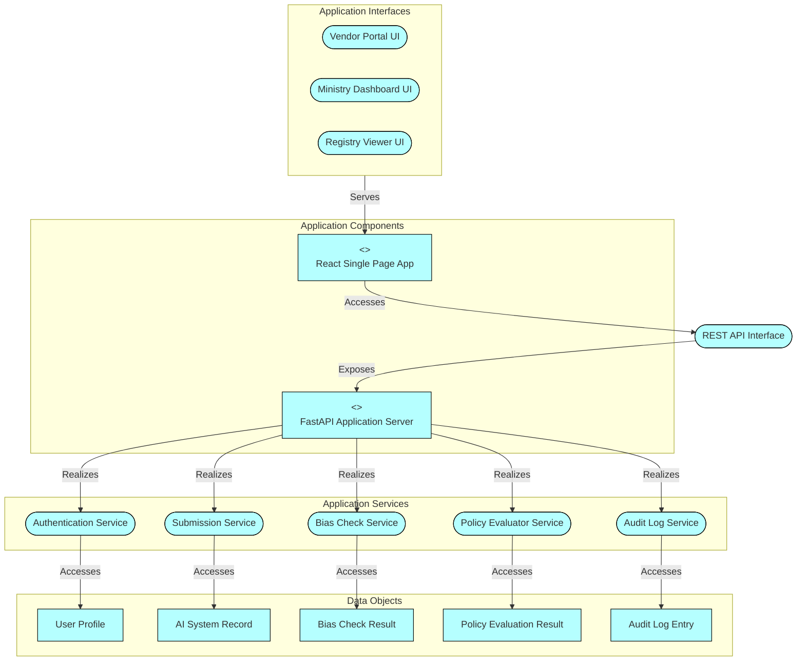
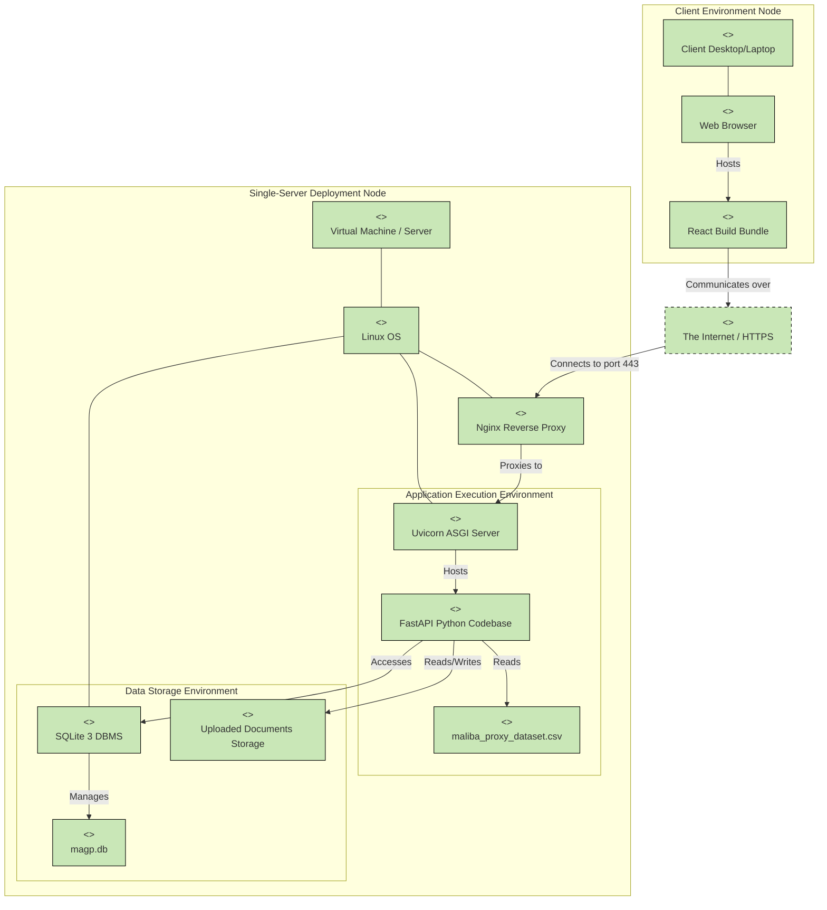

# Target Application and Technology Architecture Models
## Maliba AI Governance Platform (MAGP)

---

## 1. Document Overview

This document defines the **Target Application Architecture Model** and **Target Technology Architecture Model** for the Maliba AI Governance Platform (MAGP). The models are described using **ArchiMate 3.2** terminology and concepts to provide an end-to-end, enterprise-level view of the system.

---

## 2. Target Application Architecture Model

The Application Architecture models the software applications, their interactions, and the data they manage.

### 2.1 ArchiMate Application Concepts

| ArchiMate Concept | Elements in MAGP | Description |
| :--- | :--- | :--- |
| **Application Component** | • React SPA (Frontend) • FastAPI Server (Backend) | Encapsulates application functionality and data. |
| **Application Interface** | • RESTful API (HTTPS) • Vendor Portal UI • Ministry Dashboard UI | The point of access where application services are made available to users or other applications. |
| **Application Service** | • Submission Service • Bias Check Service • Policy Evaluator Service • Audit Log Service • Authentication Service | An externally visible unit of functionality provided by one or more components. |
| **Application Function** | • Form Data Validation • AI Model Output Analysis • Rule-based Policy Checking • Hash-chaining | Internal behavior performed by an Application Component. |
| **Data Object** | • User Profile • AI System Record • Bias Check Result • Policy Evaluation Result • Audit Log Entry • Legal Document (CBA/SCC) | Data structured for automated processing. |

### 2.2 Application Architecture Viewpoint

---

## 3. Target Technology Architecture Model

The Technology Architecture models the software and hardware infrastructure required to support the Application Layer.

### 3.1 ArchiMate Technology Concepts

| ArchiMate Concept | Elements in MAGP | Description |
| :--- | :--- | :--- |
| **Node** | • Deployment Server • Client Device | A computational or physical resource that hosts, manipulates, or interacts with other computational or physical resources. |
| **Device** | • Server Hardware (VM/Bare Metal) • Desktop/Laptop/Mobile | A physical IT resource upon which system software and artifacts may be stored or deployed. |
| **System Software** | • Linux OS (Ubuntu) • Nginx (Reverse Proxy) • Uvicorn (ASGI Server) • SQLite 3 (DBMS) • Web Browser | Software environment for specific types of components and data objects. |
| **Technology Interface** | • Port 443 (HTTPS) • File System I/O | Point of access where technology services are offered. |
| **Artifact** | • React Build Bundle (JS/CSS/HTML) • Python Codebase (`.py` files) • SQLite File (`magp.db`) • `maliba_proxy_dataset.csv` | A piece of data that is used or produced in a software development process, or by deployment and operation of a system. |
| **Communication Network** | • The Internet • Internal LAN / Localhost | A set of structures that connects computer systems or other electronic devices for transmission of data. |

### 3.2 Technology Architecture Viewpoint

---

## 4. Alignment Between Application and Technology Layers

The following demonstrates how the Application Architecture maps onto the Technology Architecture (Cross-Layer Dependencies):

1. **Frontend Hosting**: The **React SPA (Application Component)** is realized by the **React Build Bundle (Artifact)**, which is hosted within the **Web Browser (System Software)** running on the **Client Device (Device)**.
2. **Backend Execution**: The **FastAPI Application Server (Application Component)** and its associated **Application Services** (Submission, Bias Check, Policy, Audit, Auth) are realized by the **FastAPI Python Codebase (Artifact)**. This artifact is executed by **Uvicorn (System Software)** on the **Deployment Server (Node)**.
3. **Data Persistence**: The **Data Objects** (Submissions, Results, Audit Logs) are realized by the **magp.db (Artifact)**, which is managed by **SQLite 3 (System Software)**. 
4. **Proxy Dataset**: The **Bias Check Service (Application Service)** accesses the **maliba_proxy_dataset.csv (Artifact)** directly from the file system to execute algorithmic fairness tests.
5. **Secure Communication**: The **REST API (Application Interface)** is realized by the **HTTPS Connection** over **The Internet (Communication Network)**, securely terminated by **Nginx (System Software)**.

---

## 5. Summary of Architecture Decisions

* **Monolithic Single-Server Architecture**: Aligns with LMIC context constraints (low infrastructure overhead). The entire Application and Technology stack resides on a single Node.
* **Embedded Database**: SQLite represents a lightweight System Software choice that avoids the need for dedicated DBMS nodes, fitting perfectly into the single-node deployment target.
* **Decoupled Client-Server**: React SPA strictly consumes a standard REST API, ensuring that future integration points (e.g., mobile apps) can utilize the same underlying Application Services.
* **Immutable Storage via Application Logic**: The Audit Log Service guarantees immutability through hash-chaining at the Application Layer rather than relying on complex Distributed Ledger Technology (DLT) at the Technology Layer.
